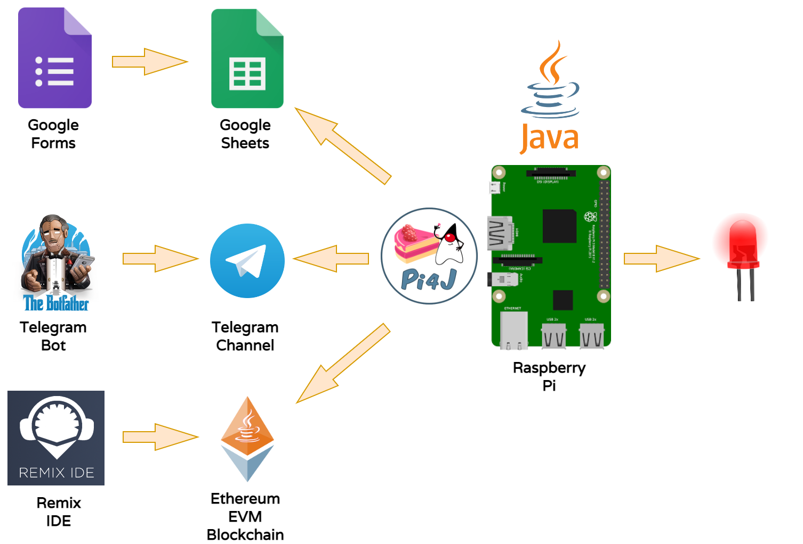
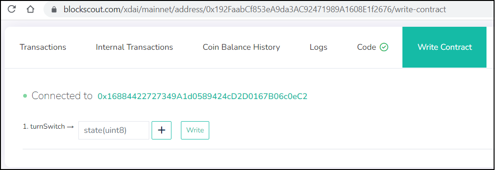
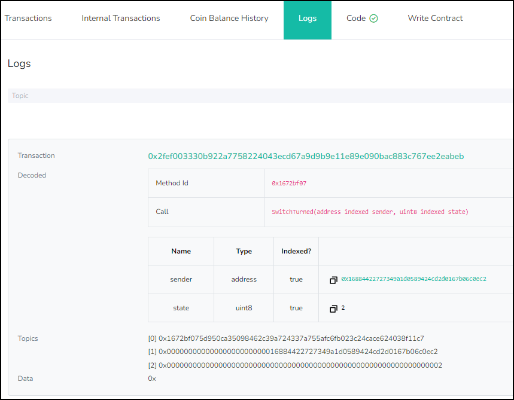
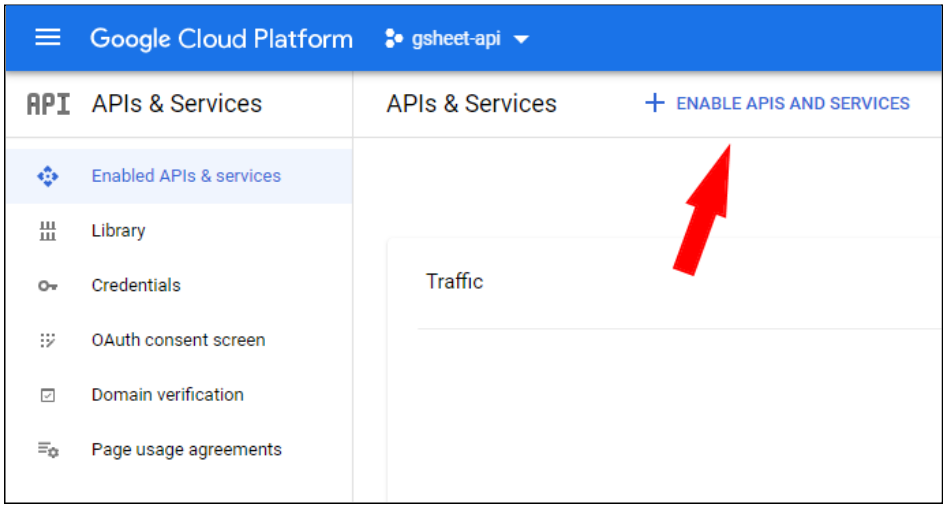
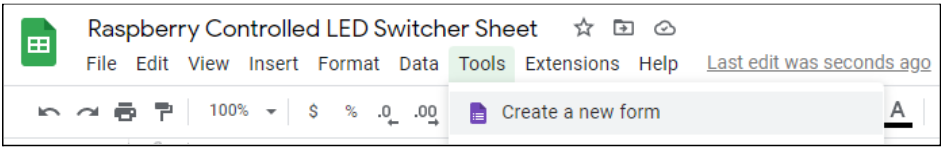
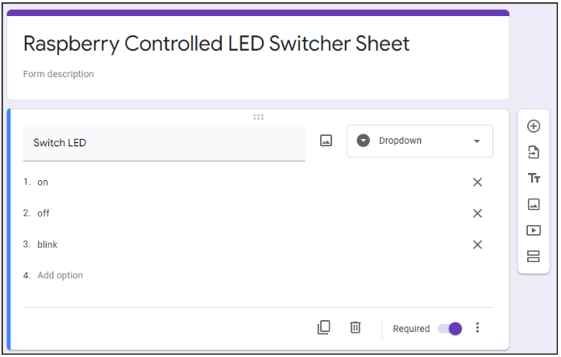
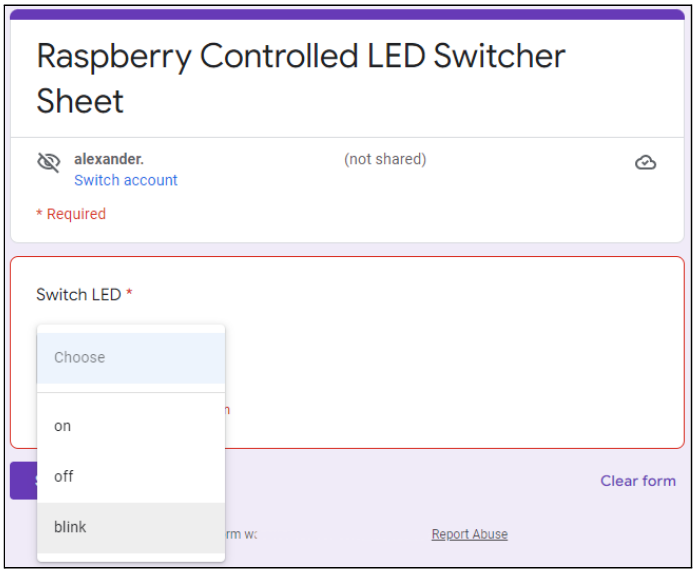
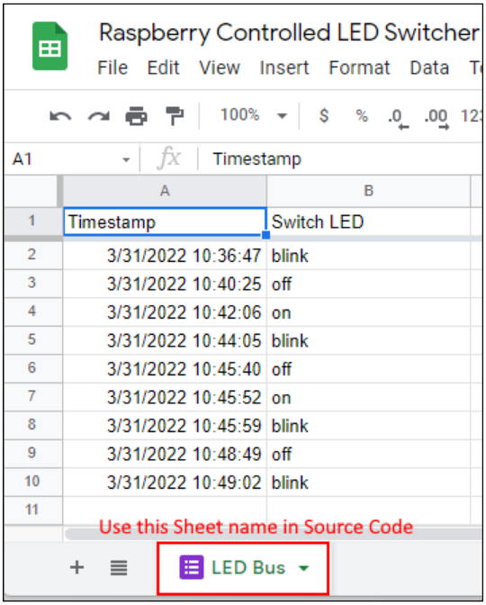
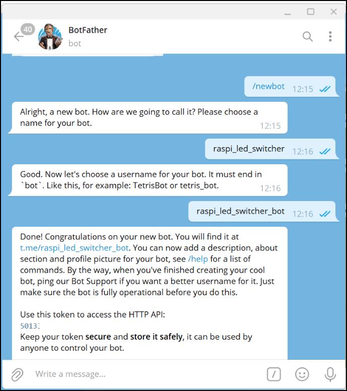
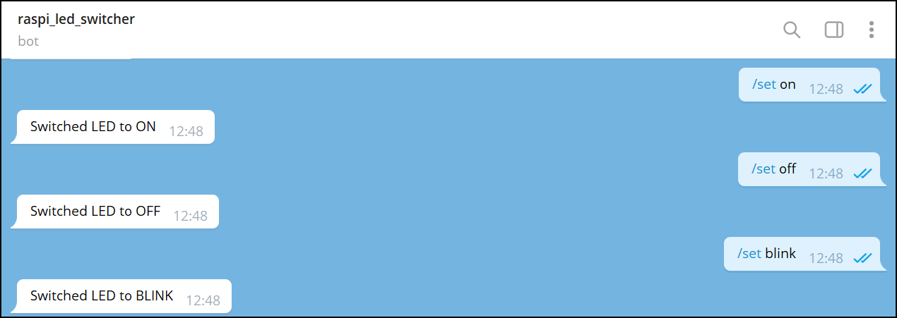

# ethereum-gsheets-telegram-raspi-messaging

## DIY: Build Stupid and Crazy Expensive Messaging for LED Switches

This repo contains the Spring Boot messaging modules for all three messaging options (Google Sheets, Telegram Bot, Ethereum/Gnosis Chain) mentioned in the [accompanying blog post](https://ice09.github.io/build-crazy-messaging-raspi/). 

<p align="center"></p>

## Setup

### Start on Raspberry Pi

_Note: Pi4j must be invoked as **sudo**_

```
sudo `which java` -jar raspi-messaging-0.0.1-SNAPSHOT.jar --spring.config.location=./application.properties --spring.profiles.active=prod
```

### Configure Messaging

You can choose between the Messaging types *GoogleSheet*,*TelegramBot*, or *Web3* by modifying the `application.properties`.

```
web3.module.enabled=${WEB3_MODULE_ENABLED:true}
gsheet.module.enabled=${GSHEET_MODULE_ENABLED:false}
tgram.module.enabled=${TELEGRAM_MODULE_ENABLED:false}
```

In the sample configuration above, *Web3* is enabled by default.  
However, all parameters have to be set by setting the environment variables.

## Web3 Messaging

For *Web3* Messaging, these parameters have to be set:

```
web3.ethereum.rpc.url=${ETHEREUM_NODE_IP_PORT:https://dai.poa.network/}
web3.switch.contract.address=${ETHEREUM_CONTRACT}
web3.mnemonic=${ETHEREUM_MNEMONIC:test test test test test test test test test test test junk}
```

* For the Ethereum RPC Url, you can look at http://pokt.network or use https://dai.poa.network/ for testing purposes.
* The Gnosis Chain contract address (if not set, contract is deployed)
* Mnemonic for account address, which is used to derive the private keys of the accounts

### Solidity Smart Contract

We are using a *dumb* (smart) contract here. *A dumb contract is a smart contract pattern that takes advantage of Events, and their relative cheapness compared to writing to storage.* _Read more about Dumb Contracts here: https://anallergytoanalogy.medium.com/adventures-with-dumb-contracts-18f8ce8414c9_

We can save money here as we are only interested in the Event `SwitchTurned` with the state `0:off, 1:on, or 2:blink` and the sender, which we use to differentiate between devices.  

With this setup, you can even reuse the already deployed contract at `0x192FaabCf853eA9da3AC92471989A1608E1f2676` if you scan for both arguments (in our setup, only `state` is evaluated).

```solidity
// SPDX-License-Identifier: GPL-3.0
pragma solidity >=0.7.0 <0.9.0;

contract Switch {

    address creator;

    event SwitchTurned(address indexed sender, uint8 indexed state);

    constructor() {
        creator = msg.sender;
    }

    function turnSwitch(uint8 state) public {
        emit SwitchTurned(msg.sender, state);
    }

}
```

* Write the Smart Contract function `turnSwitch`, eg. in the Remix IDE (https://remix.ethereum.org/) or the Blockscout Gnosis Chain Explorer (https://blockscout.com/) 



After a successful transaction, the Event turnSwitch is emitted as the only instruction in the function is `emit SwitchTurn(...)`



## GoogleSheet Messaging

For *GoogleSheet* Messaging, 

* Go to Dashboard at https://console.cloud.google.com/
* Create new project
* Go to Google Cloud Console, Activate GSheet API




* Create GSheet, Share with “Anyone with link” for Viewer


* Create Form for GSheet to switch values






* Get API Key: https://developers.google.com/sheets/api/guides/authorizing#APIKey

_Note: Restrict Key to Google Sheet_

* Configure Properties `spreadsheetId`, `range`, and `key`

All necessary properties are configured in the `application.properties`.

#### Authenticate Google Sheet API Calls

We are using an `HttpExecuteInterceptor` to set the API key to the HTTP Requests to authenticate for the calls.

```java
key = "AIzaSyAA1ZnStXXXXXXXXXXXXXXXXXXXXXXXX";

HttpRequestInitializer httpRequestInitializer =
request -> request.setInterceptor(
        intercepted -> intercepted.getUrl().set("key", key));

service = new Sheets.Builder(
    GoogleNetHttpTransport.newTrustedTransport(), 
    JSON_FACTORY, 
    httpRequestInitializer)
.setApplicationName(APPLICATION_NAME)
.build();
```

## TelegramBot Messaging

* Create the Bot (we used *raspi_led_switch*, if you use it, you switch our LED)



* Invite Bot *raspi_led_switcher* to a Group or chat with it directly



_Note: In your Bot, make sure that not everybody can use it, eg. by restricting it to a specific **chatId**._